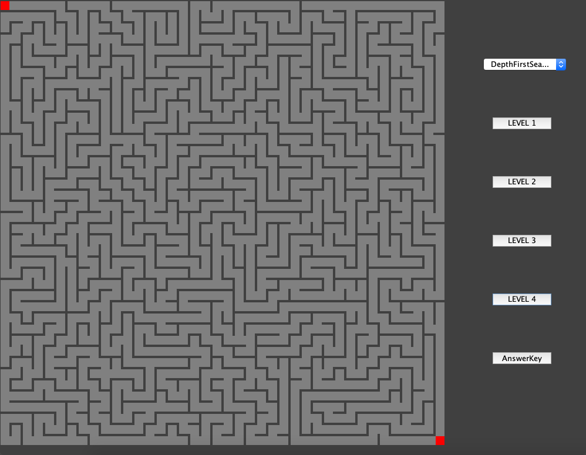

# MazeGenerator

Implemented Graph data structure to build rectangular grid arrangement of cells
Generated maze pattern by removing walls between cells with Depth-First Search algorithm, and currently applying
Kruskal’s and Prim’s algorithms

level 1 maze with Depth-First Search algorithm

level 2 maze with Depth-First Search algorithm

level 3 maze with Depth-First Search algorithm

level 4 maze with Depth-First Search algorithm

answer for level 4 maze with Depth-First Search algorithm

